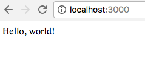
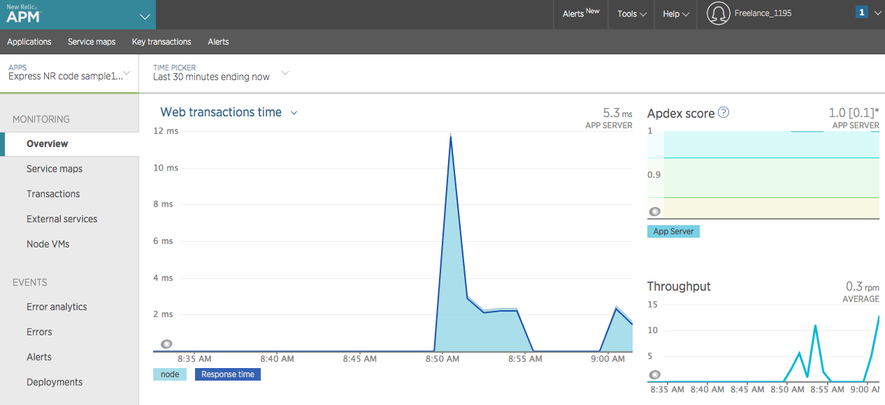

# _new-relic_

#### _Code review #1 - a simple 'hello world' server side app that uses node.js and receives data from New Relic's APM software, April 18th, 2017_

#### By _**Kyle Lange**_





## Learnings

* copying the newrelic.js file from the node_modules and entering the licence key/app name

* a basic understanding of the APM Web transaction time, Apdex, and throughput charts.

## Setup/Installation Requirements

1. Download this repo using your terminal:

```
git clone https://github.com/kylelange/new-relic.git

cd new-relic

In your terminal type: node app.js

This app should now be running on [localhost:3000](http://localhost:3000/)
```

2. View the code by drag-and-dropping the file into your [favorite text editor](https://atom.io)


## Known Bugs

_There are no known bugs as of the last commit. Please send an ISSUE on github in the repository if you see something I have not._

## Support and contact details

For questions or comments, please __email  [Kyle here.](baronsintrees@gmail.com)__

## Technologies Used

* Express.js
* Git + the Terminal
* New Relic Documentation

### License:

MIT license

Copyright (c) 2016 **_Kyle Lange_**
